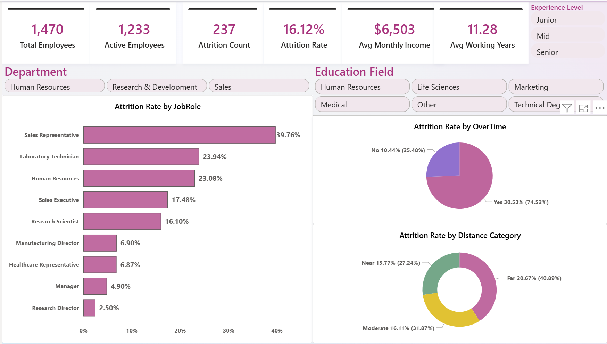
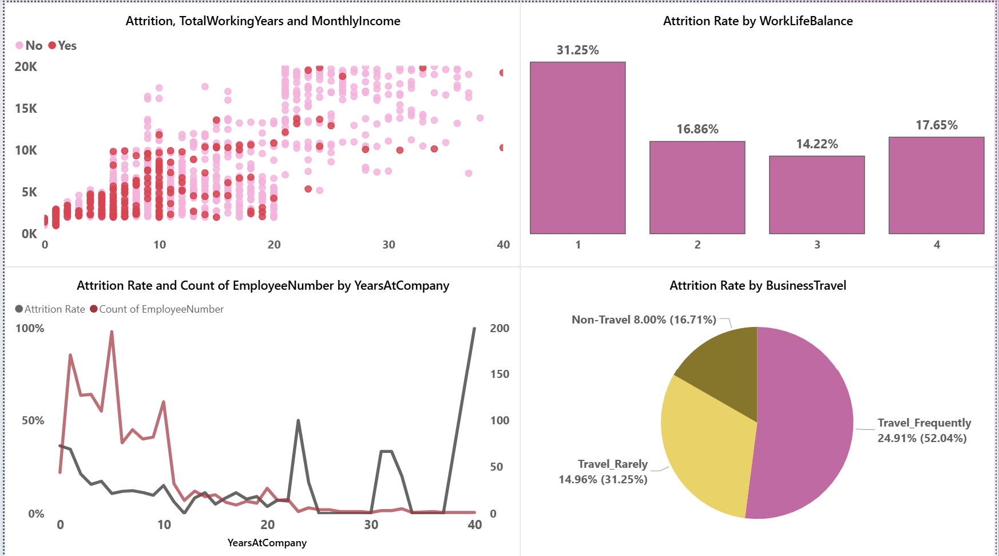

# HR Workforce Attrition Analysis & Interactive Power BI Dashboard

## Project Overview

An end-to-end HR analytics project built with **Power BI, Power Query, and DAX** to analyze employee attrition patterns, workforce demographics, and key factors affecting employee turnover.

The project focuses on identifying attrition hotspots and workforce patterns across departments, job roles, business travel, overtime, compensation, and employee tenure.

## Objective

The main goal was to analyze employee turnover patterns, measure workforce attrition, identify key risk factors, and provide actionable insights that can support HR teams in developing effective employee retention strategies.

## Tools & Technologies

- Power BI
- Power Query
- DAX (Data Analysis Expressions)
- Data Modeling
- Star Schema
- Interactive Visualizations
- Slicers
- Drill-through
- Tooltips

## What I Did

### Data Preparation & ETL

- Imported and transformed the HR dataset using Power Query.
- Cleaned and standardized employee data.
- Handled missing and inconsistent values.
- Created conditional demographic categories for analysis.

### Data Modeling

Designed a **Star Schema** data model connecting the main HR fact table with relevant dimension tables:

- `Fact_HR`
- `Dim_Department`
- `Dim_JobRole`
- `Dim_BusinessTravel`

This structure improved data organization and supported efficient DAX calculations and interactive reporting.

### DAX KPI Calculations

Created custom DAX measures to calculate key workforce metrics, including:

| KPI | Description |
|---|---|
| Total Employees | Total number of employees |
| Active Employees | Employees currently active |
| Total Attrition | Number of employees who left |
| Attrition Rate | Attrition Count / Total Employees |
| Average Monthly Income | Average employee monthly income |
| Average Years at Company | Average employee tenure |

## Interactive Power BI Dashboard

The report consists of two analytical pages.

### Page 1 — HR Summary

Provides a high-level overview of the workforce, including:

- Employee KPI Cards
- Department distribution
- Attrition by gender
- Attrition by age group
- Workforce overview
- Interactive slicers

### Page 2 — Attrition Trends & Outliers

Provides a deeper analysis of factors associated with employee attrition, including:

- Overtime vs. Attrition
- Job Role attrition patterns
- Business Travel analysis
- Employee tenure
- Compensation patterns
- Attrition outliers
- Detailed employee analysis

## Key Insights

### Department & Job Role

The analysis identified departments and job roles with relatively higher attrition rates, helping highlight potential workforce retention risks.

### Overtime & Work-Life Balance

Employees working overtime showed a substantially higher attrition rate compared with employees who did not work overtime, indicating a potential relationship between workload and employee turnover.

### Business Travel

Employees who traveled frequently for business showed higher attrition levels, highlighting business travel frequency as a potential retention risk factor.

### Compensation & Tenure

Attrition was particularly noticeable among early-tenure employees and employees in lower salary bands, highlighting the importance of effective onboarding, career development, and competitive compensation.

## Key Takeaway

The analysis highlights several workforce factors that can contribute to employee attrition, particularly **overtime, business travel, early tenure, job role, and compensation**.

These insights can help HR teams identify higher-risk employee groups and develop targeted retention strategies.

## Project Files

| File | Description |
|---|---|
| `HR_Attrition.pbix` | Complete Power BI report including data model, Power Query transformations, DAX measures, and interactive dashboards |
| `Page1-HR-Summary.png` | HR Summary dashboard preview |
| `Page2-Attrition-Trends.png` | Attrition Trends & Outliers dashboard preview |

---

**Project Type:** HR Data Analysis  
**Tools:** Power BI • Power Query • DAX • Data Modeling  
**Dashboard Pages:** 2
